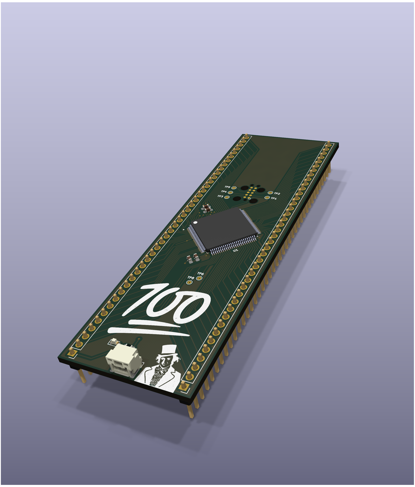
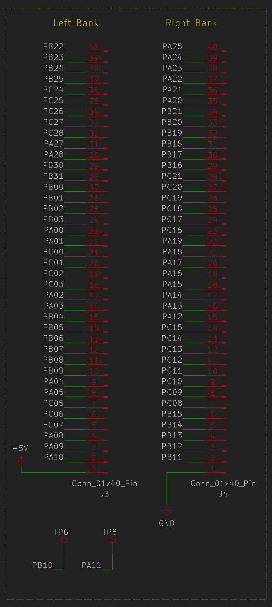
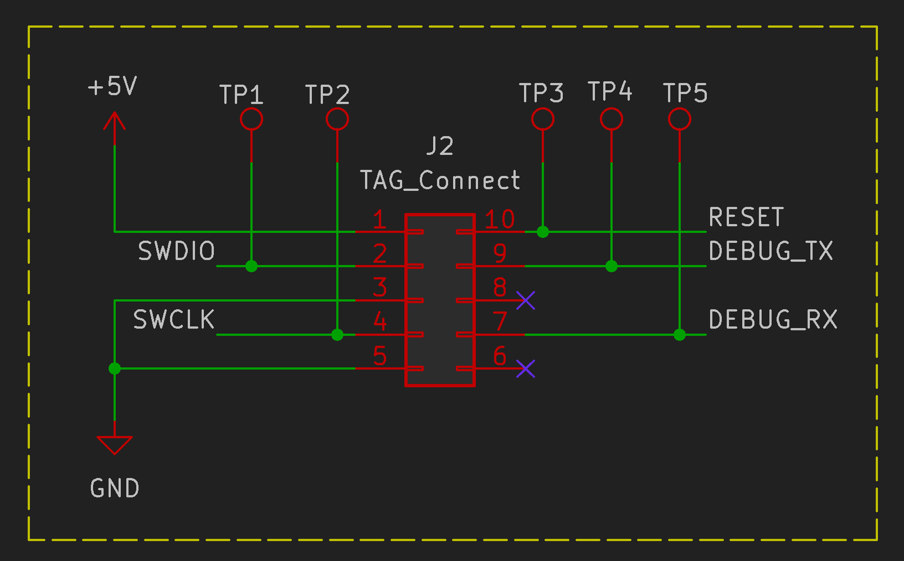

# 🎩 The Wonka-100
## A barebones devboard to help make your dreams come true

The Wonka-100 features a SAMC21N18A TQFP microcontroller, TAG-Connet SWD + debug UART interface, and a JST GH series connector for power.

---

### Model

### Pinout

### SWD + Debug UART Interface

